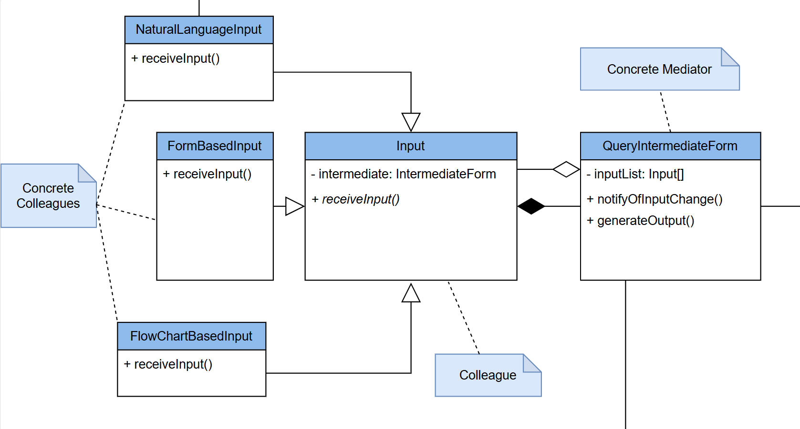
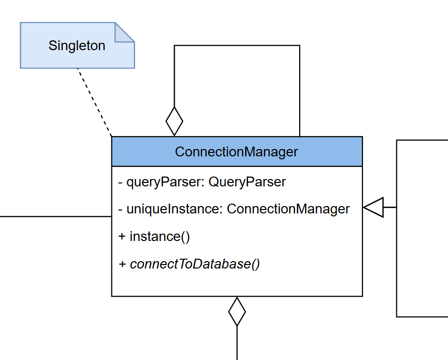
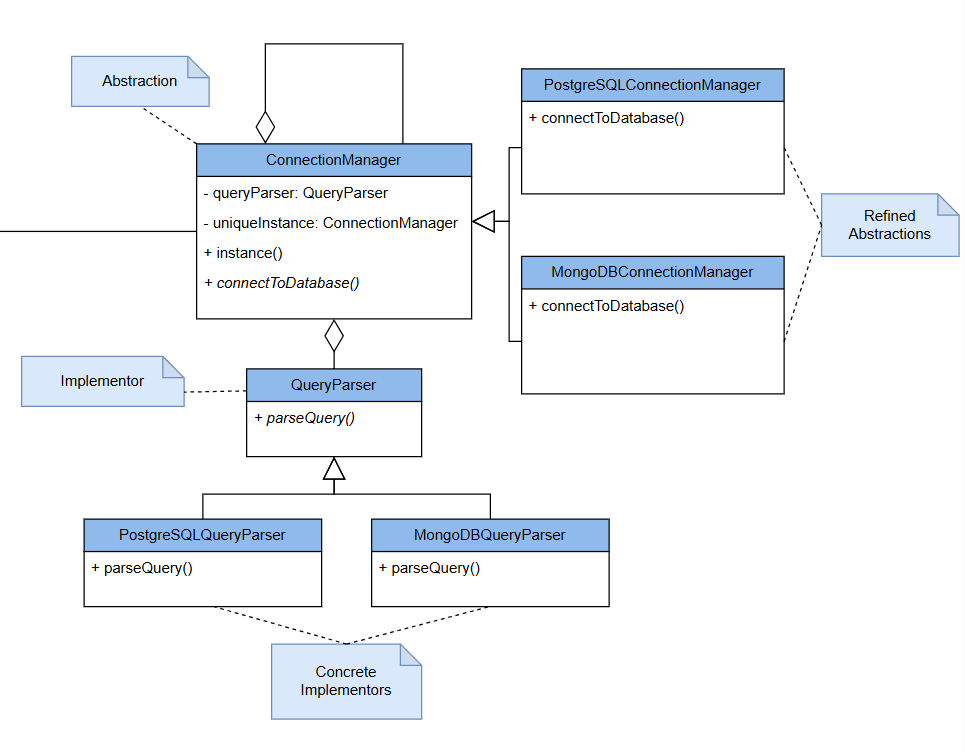

# Design Patterns
*Below you will find all design patterns that we are planning to implement into the system*

## Mediator

*The mediator design pattern defines an object that encapsulates how a set of objects interact. This pattern promotes loose coupling by preventing objects from referring to each other explicitly, allowing their interactions to be varied independently. It centralises complex communications and control logic between related objects.*

Used for communication between the different types of inputs (colleagues) which use the QueryIntermediateForm as the mediator for their communication. Different inputs provide different interfaces that the user can use, and reflect changes that have been made to other inputs.

## Singleton

*The singleton design pattern ensures that a class has only one instance and provides a global point of access to that instance. This pattern is useful when exactly one object is needed to coordinate actions across the system.*

Singleton will be used to ensure that there is only one instance of the database ConnectionManager, and thus only one instance of a connection to a database at a time - to preserve computing resources.

## Bridge

*The bridge design pattern decouples an abstraction from its implementation so that the two can vary independently. This pattern involves an abstraction and an implementation being developed independently and the client can use them together. It's useful for scenarios where you want to avoid a permanent binding between an abstraction and its implementation.*

Used to have different ConnectionManagers as abstractions, which can then have different QueryParsers as their implementations to generate their queries. This allows the easy addition of new ConnectionManagers and QueryParsers for new database types, as well as the reuse of QueryParsers across different ConnectionManagers, ultimately allowing for high scalability of the system.

