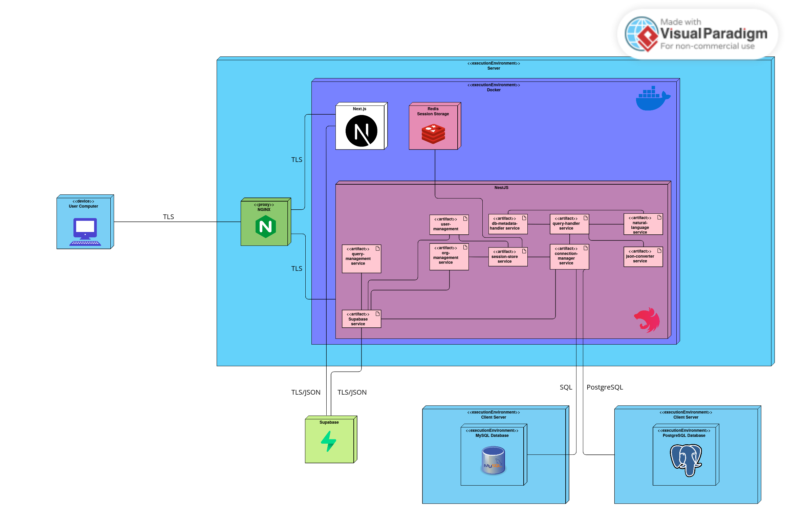

# Deployment

## Deployment Diagram

## Explanation

>**Note:** The entire application is Dockerized using *Docker Compose*. This allows for easy deployment, should, for example, the user want to host it locally if the database is sitting behind a firewall.  

A user is able to connect to the QBee application through the web browser.
They are then routed through the Nginx proxy to the Next App which serves the user with the Next.js frontend application. The Next.js application then makes requests to the backend allowing the user to interact with their PostgreSQL or MySQL databases, which may sit outside the server.

Supabase is used for authentication and stores some data relating to the workings of the backend.

The backend itself is a NestJS API that can accepts requests, with most requests requiring authentication. Hence, the backend can be called as if it were an API, but in most scenarios it will be used through the Next.js frontend as all authentication is then done behind the scenes.

The Redis store houses backend session data for users. This includes unique ways to map users to database connections that are already open, increasing performance and usability as there is less of a wait, assuming that there is an open connection.
