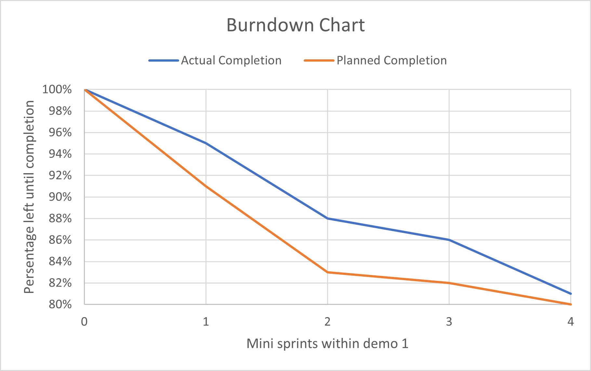
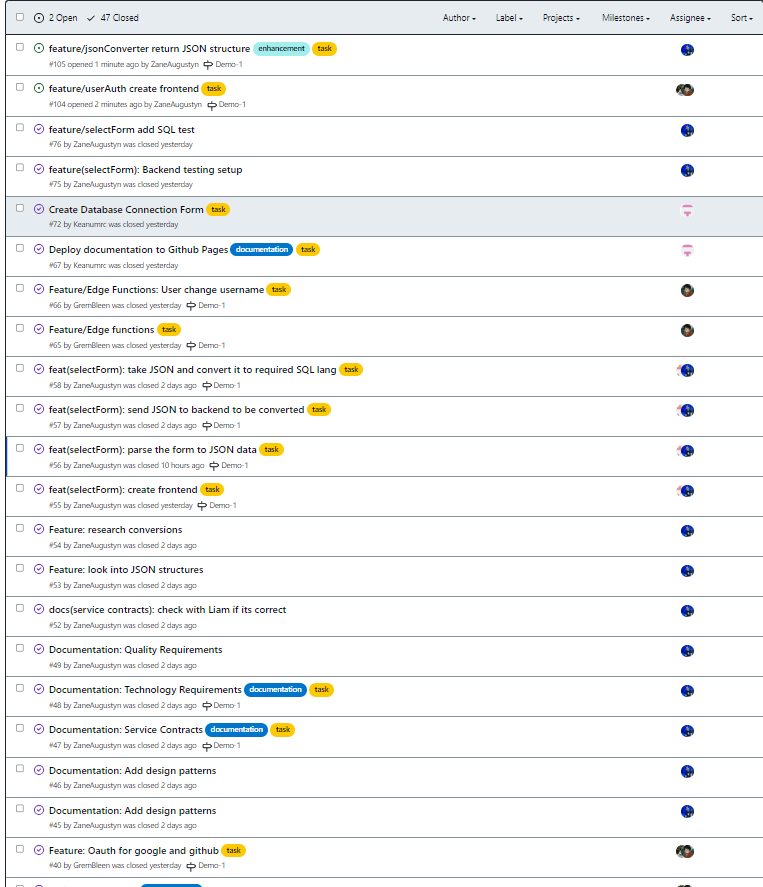
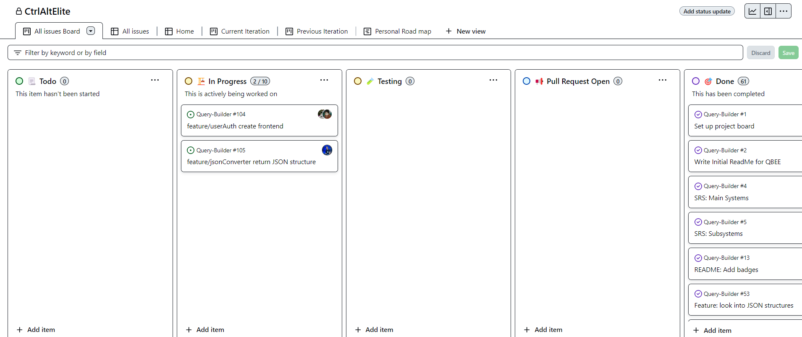

During the course of the Demo 1 work sprint, we carried out four 'mini-sprints'. The below charts and boards analyse some of our performance over these mini-sprints.

## Burndown Chart

*Burndown charts can be used to track the amount of work that has been completed, versus the amount of work left to be completed, at points during a sprint in the Agile Development Process.*

We estimate that we have completed somewhat under 20% of the total project effort over the entire Demo 1 sprint, as indicated on the burndown chart below. Ideally the 'actual completion' line should run below the 'planned completion' line in a burndown chart, indicating work being completed in advance, and this is something that we can work on achieving as a team for future demos.

## Github issues related to chart

We use Github Issues to track the tasks to be completed over an Agile sprint, and to monitor when they are actually completed. This can be useful to plot a burndown chart. The below image showcases a number of our closed and completed issues for demo 1, as well as two issues still to be completed. All issues can be viewed in our [Github repository issues board](https://github.com/COS301-SE-2024/Query-Builder/issues).

## Scrum Board

We use a Scrum or Project Board to keep track of the various stages that issues can be in, over the course of an Agile sprint. An issue begins in the **Todo** stage, then is actively worked on in the **In Progress** stage. Once a pull request is made to our development branch, the issue enters the **Pull Request Open** stage, and **Testing** may be performed too. If changes are requested on the completed work, the issue can be assigned to the **Errors/Changes Requested** stage, and finally issues can be marked as **Done**. Our Github Scrum Board can be viewed in our [Github Project](https://github.com/orgs/COS301-SE-2024/projects/55/views/4).

