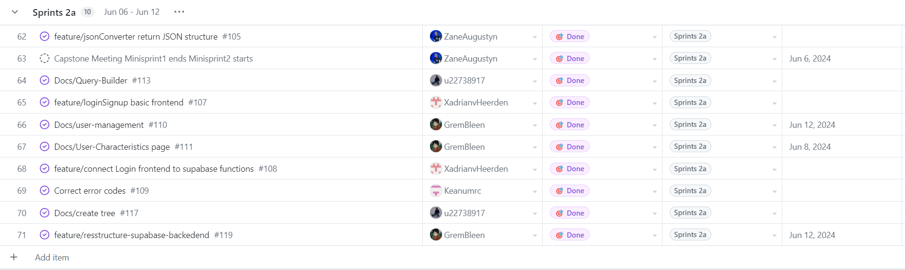
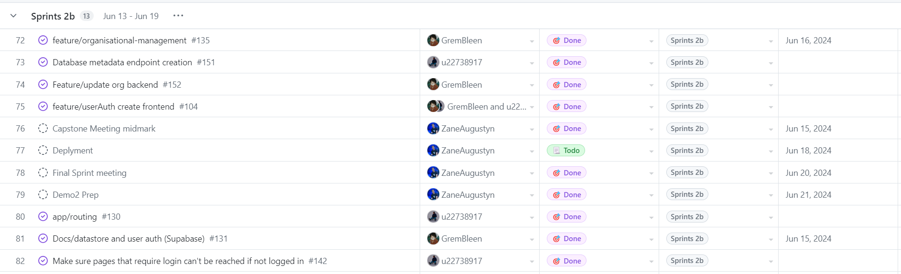

During the course of preparing for demo 2, we carried out two work sprints - sprint 2a and sprint 2b

## Sprint 2a

Sprint 2a ran from the 6th of June till the 12th of June and focused largely on planning for demo 2, finishing any backlog from demo 1 and finishing documentation for demo 2.

Here is our Github Project Board for sprint 2a:

## Sprint 2b

Sprint 2b ran from the 13th of June till the 19th of June and focused largely on implementing 3 components for demo 2 (the Form-based Query Builder, Query Table Response and Query Report Generator).

Here is our Github Project Board for sprint 2b:

