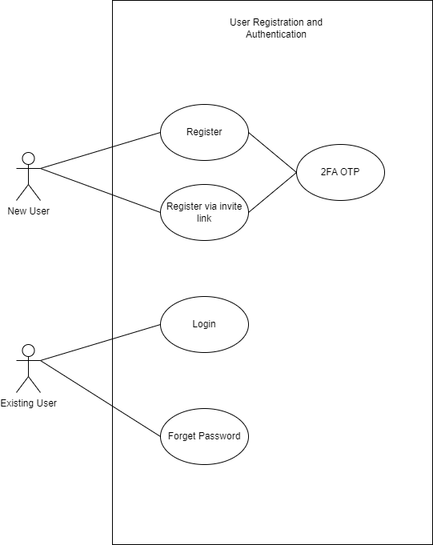
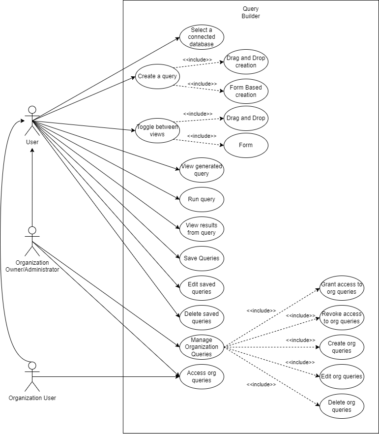
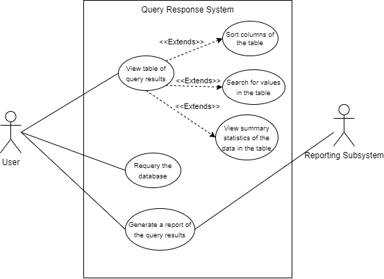

# Use Case Diagrams

## User registration and Authentication

## User Management

## Database System manager

## Query Builder

## Query Response System

## Reporting system

## Organisation system

