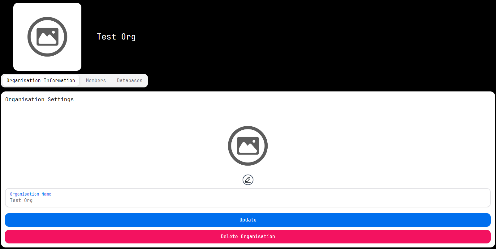

# Organisation Management

### Create Organisations
Users can create organisations once they are logged in. To create an organisation, you need to input the organisation name. The organisation name should be unique. If the organisation name is already taken, you will be prompted to enter a different name.

### Edit Organisations
Users can edit organisations once they are logged in. To edit an organisation, you need to click on the organisation you want to edit. You can then edit the organisation name and save the changes. This includes changing the organisation name, adding or removing users from the organisation, and changing the organisation's connected databases.

Organisation members need a join code to join the organisation. The join code can be found in the organisation settings.
Once a member has joined the organisation, they need to be verified by an admin or owner. The admin or owner can verify the member by clicking on the member and clicking the verify button. The member will then be able to access the organisation's data.
Members can have different roles in the organisation. The roles are owner, admin, and member. The owner has full control over the organisation, including adding and removing users, changing the organisation's settings, and deleting the organisation. The admin has control over the organisation's settings, including adding and removing users and changing the organisation's settings. The member has access to the organisation's data but cannot change the organisation's settings.

### Database Management
Users can connect databases to organisations once they are logged in. To connect a database to an organisation, you need to click on the organisation you want to connect the database to. You can then click on the connect database button to connect the database. You will need to provide the database name, host, port, username, and password. Once the database is connected, you will be able to query the database using the query builder.

### Database Access
Users can access databases once they are connected to an organisation and are given access by an admin or owner. To access a database, you need to click on the organisation you want to access the database for. You can then click on the database you want to access. You will then be able to query the database using the query builder.

### Delete Organisations
Users can delete organisations once they are logged in. To delete an organisation, you need to click on the organisation you want to delete. You can then click on the delete button to delete the organisation.

 