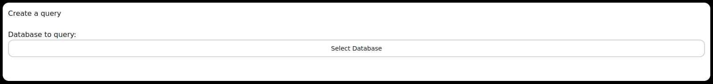
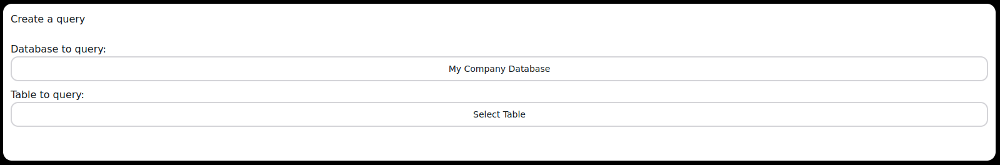
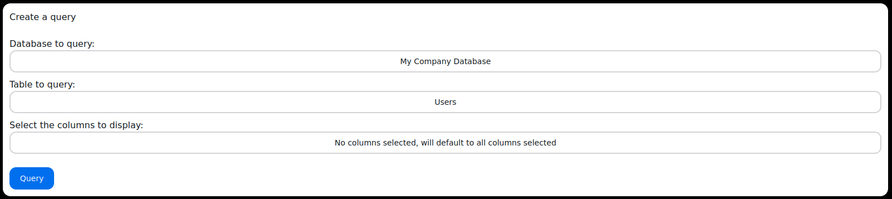

# Query Builder
Once a database has been selected to be queried and a successful connection has been established, you will be able to query the database using either a ***Query Builder*** or ***Query Quill*** system.

## Form Manipulation
### Selecting schema
  

When the form initially loads, you will be asked to enter in the Schema you would like to query. This is necessary as some databases host multiple schemas.
You will be able to change the schema by clicking 'Select Database'.

### Selecting Table
  

After a schema has been selected, you can select the table that you want to create your query for. This is done in the same manner as in the previous step, but instead of clicking 'Select Database', you will instead click 'Select Table'.

### Selecting Columns
  

Now you are able to select all of the columns you would like to query. This differs slightly from the previous steps as you are able to select multiple columns. This can be initiated by clicking 'No columns selected, will default to all columns selected'.  
You can select or deselect all columns by clicking the 'Select All' option.

You are now ready to query by clicking the 'Query' button.

### Selecting Filters
Now that you have selected the columns you would like to query, you can now filter the data that you would like to see. This can be done by clicking the 'Add Filter' button. The filter can be configured by selecting the column you would like to filter by, the operator you would like to use, and the value you would like to filter by. They can also be used to calculate the sum, average, minimum, and maximum of a column.The filter will be applied to the data that is returned from the query.
The filter can be removed by clicking the 'Remove Filter' button.

## Query Quill
The Query Quill system allows you to ask a LLM model to generate a query for you. This can be done by typing in a question in the text box and clicking the 'Query' button. The LLM model will then generate a query for you based on the question you asked.
You can also use the text-to-speech feature to ask a question by clicking the microphone button.
<!-- TODO add image -->