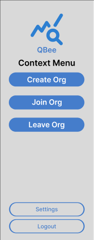
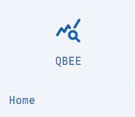
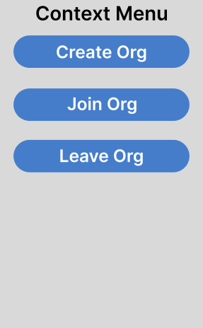
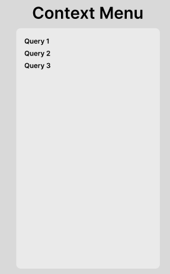

# Sidebar User Guide

## Introduction
  

The sidebar is the main way of navigating between different parts of our program. It also provides you with a context menu that changes depending on the part of the program you are accessing.

## Getting Home
  

The QBee Logo can be clicked to return home from any part of the program.

## Context Menu

The context menu allows you to get context dependent functionality. For example, on the homepage it will allow you to create, join and leave organizations, while, when you are querying a database it provides saved and organization queries that you can rerun.

## Accessing User Settings
  

The User settings can be accessed by clicking the 'Settings' button.

## Logging out
  

You can logout of your account by clicking the 'Logout' button.