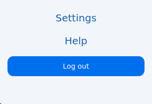

# Sidebar User Guide
## Introduction
The sidebar is the main way of navigating between different parts of our program. It also provides you with a context menu that displays saved and shared queries.

## Getting Home
The home button allows you to get back to the homepage from anywhere in the program.

## Context Menu
The context menu allows you to access saved and shared queries. You can also save, share and delete queries from this menu. These queries can be used to repopulate the query builder with the saved query by clicking the 'Retrieve Query' button.

## Accessing User Settings
The User settings can be accessed by clicking the 'Settings' button.

## Logging out
You can logout of your account by clicking the 'Logout' button.

