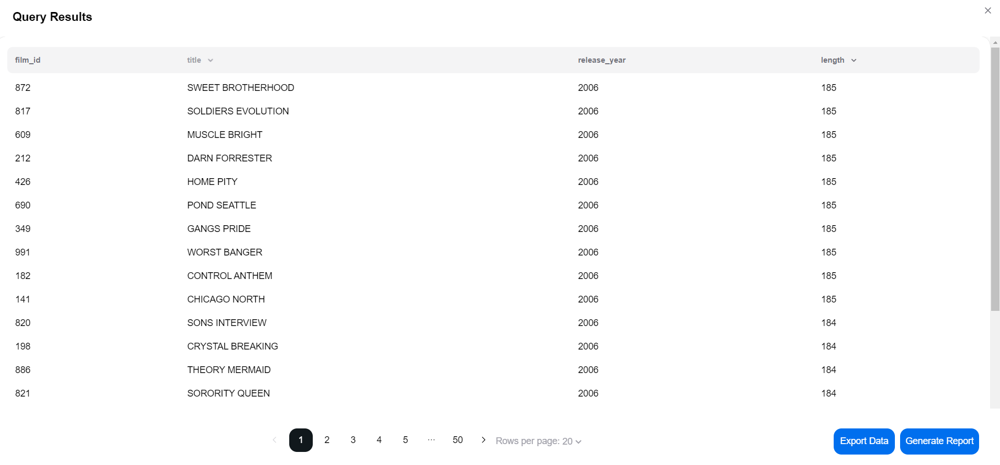
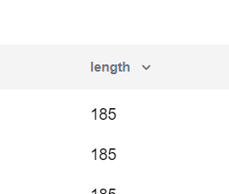

# Table Response

After executing a query using either the form input, flow-chart input, or natural language input, QBee will return your data in a user-friendly table format.

 

## Navigating the table

For large amounts of data, the table is split up across multiple pages. Simply use the page navigation bar below the table to navigate between the different pages. You can also use the dropdown menu to select how many rows of data you would like to see per page.

 

## Sorting the data

You can sort the data in each column by clicking on the column header. An up-arrow indicates that the data is sorted in ascending order, whilst a down-arrow indicates that the data is sorted in descending order.

 

## Exporting the data

Click on the "Export Data" button to export the query result data as a comma-separated values (.csv) file, which can then be opened by a wide variety of different spreadsheet software.

 

## Generating reports

Click on the "Generate Report" button to generate a report of your table data, including charts and visuals.

 