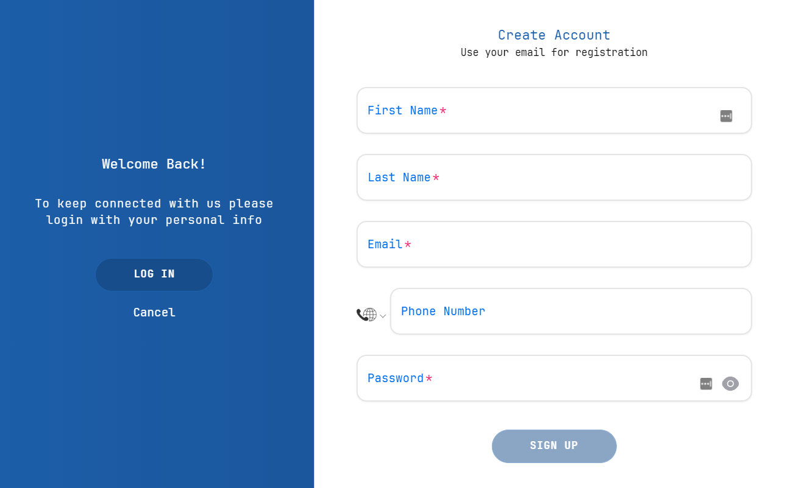
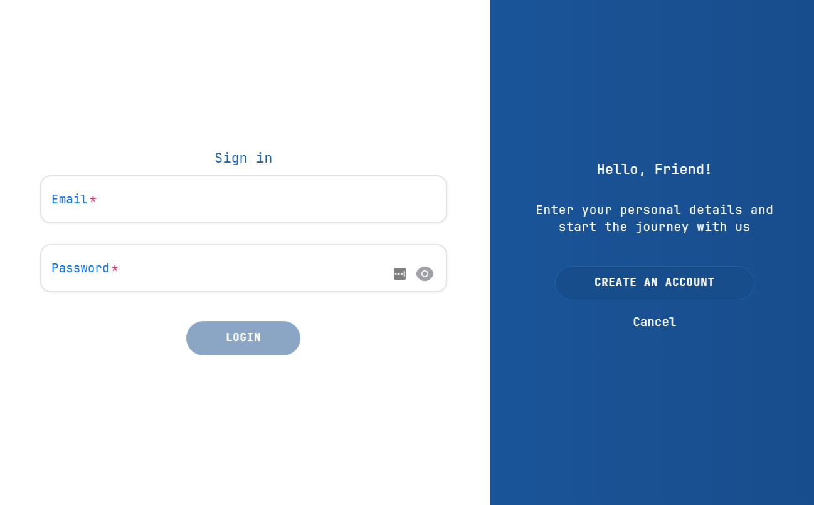
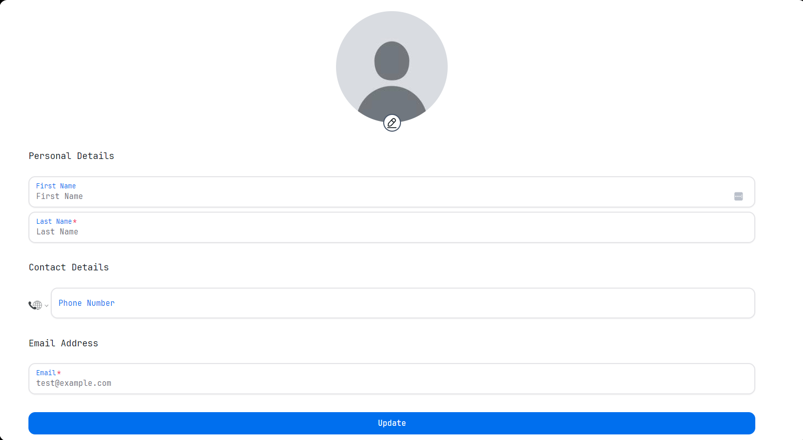

# User management User Guide

### Sign Up
When you first access the application, you will be prompted to sign up. You will need to provide your email address and a password. You will also need to agree to the terms of service and privacy policy. Once you have signed up, you will be able to log in to the application.

### Log In
To log in to the application, you will need to provide your email address and password. If you have forgotten your password, you can reset it by clicking on the "Forgot Password" link. You will receive an email with instructions on how to reset your password.

### User Profile
Once you have logged in, you will be able to view and edit your user profile. You can update your email address, password, and other personal information. You can also upload a profile picture.

